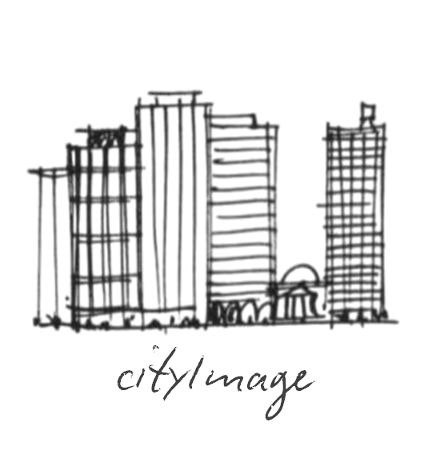

cityImage's documentation
=========================

Introduction
------------

`cityImage` is a Python package that supports the extraction of the Image of the City by using geospatial datasets, either provided by the user or directly downloaded from OpenStreetMap.

Theoretical considerations
--------------------------

The *Image of the City* is a community mental representation of a city resulting from the overlap of people's individual images of the city. The term "image of the city" coincides, to some extent, with other notions such as cognitive map, mental images, and image schemata, conceptualizing cognitive representations of urban space.

In a nutshell, these are cognitive mental models employed to navigate and interact with urban elements. Lynch identified five urban elements that are shared across the citizens and visitors of a city: paths, nodes, edges, districts, and landmarks.

Whereas Lynch originally used qualitative interviews to identify the image of cities like Los Angeles, Boston, and New Jersey, this library allows the identification of such shared salient elements from geospatial datasets. For more details on Lynch’s work and the geo-computational formulation, refer to: Filomena, G., Verstegen, J. A., & Manley, E. (2019). `A computational approach to The Image of the City. Cities, 89, 14–25 <https://doi.org/10.1016/j.cities.2019.01.006>`_.

How to install
--------------

From PyPI using pip:

.. code-block:: bash

    pip install cityImage

Main purposes
-------------

The functions implemented in `cityImage` enable the identification of the five Lynchian elements:

- **Nodes** and **Paths**: Identified based on betweenness centrality measures computed on the street network. Paths can be identified from both primal and dual graph representations of the street network, utilizing angularity measures.
- **Districts**: Urban regions identified using network community detection techniques (e.g., modularity optimization).
- **Edges**: Natural and artificial barriers such as rivers, railway structures, and main roads.
- **Landmarks**: Computational landmarks based on visual, structural, cultural, and pragmatic salience.

Additional functions
--------------------

The library also presents a set of novel spatial methods and algorithms not typically implemented in Python environments:

- Supports straightforward scraping from OSM of buildings and street network data into `GeoPandas` GeoDataFrames.
- Allows cleaning and simplifying graph representations of the street network (module `clean`).
- Facilitates operations on dual graph representations of the street network (modules `load` and `graph`).
- Computes 3D sight-lines towards buildings and calculates actual 3D visibility considering obstructions, leveraging the capabilities of the `pyvista` package. This is a valid, free, and open alternative to sightlines computation in ArcGIS.
- Provides ready-to-use visualization tools that support the comparison of metrics of interest across cities (module `plot`), such as accessibility values, centrality values, etc.

The examples in the rest of the documentation (see the `userGuide <https://cityimage.readthedocs.io/en/latest/notebooks/userGuide.html>`_) demonstrate the capabilities of the library.

Documentation content
---------------------
  
.. toctree::
   :maxdepth: 1

   Home <self>
   User Guide <notebooks/userGuide.rst>
   API reference <api>
