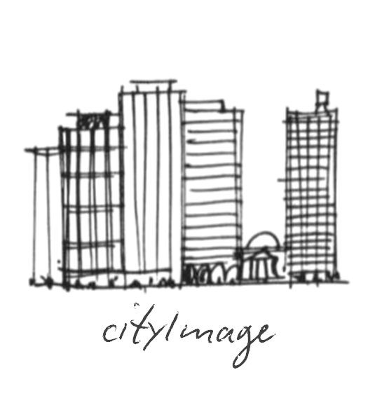

cityImage's documentation
=========================

Introduction
------------

``cityImage`` is a Python package for extracting a computational representation
of Lynch's *Image of the City* from geospatial data. It works with user-provided
GeoPandas datasets and with OpenStreetMap data acquired through OSMnx, while
preserving a cityImage-specific schema for networks, buildings, barriers,
districts, landmarks, and imageability scores.

Theoretical considerations
--------------------------

The *Image of the City* is a community mental representation of a city resulting
from the overlap of people's individual images of urban space. The term overlaps
with related notions such as cognitive maps, mental images, and image schemata.

Lynch identified five urban elements commonly shared across citizens and
visitors: paths, nodes, edges, districts, and landmarks. Whereas Lynch's original
work relied on qualitative interviews, ``cityImage`` supports a computational
formulation based on geospatial data.

For the original computational formulation, see: Filomena, G., Verstegen, J. A.,
& Manley, E. (2019). `A computational approach to The Image of the City. Cities,
89, 14–25 <https://doi.org/10.1016/j.cities.2019.01.006>`_.

Installation
------------

Core install:

.. code-block:: bash

   pip install cityImage

Install with all optional extras:

.. code-block:: bash

   pip install "cityImage[all]"

Main API areas
--------------

The refactored API separates cityImage-owned semantics from external libraries:

- ``cityImage.io``: file/GeoPandas loading into cityImage schemas.
- ``cityImage.osm``: OSMnx acquisition into cityImage schemas.
- ``cityImage.network`` and ``cityImage.network_topology``: street-network
  construction, cleaning, simplification, and topology repair.
- ``cityImage.graph`` and ``cityImage.angles``: primal/dual graph semantics and
  angular relationships.
- ``cityImage.barriers``: natural and artificial barriers such as rivers,
  railways, parks, and major roads.
- ``cityImage.regions``: districts and gateways from network partitions.
- ``cityImage.landmarks`` and ``cityImage.scoring``: Lynchian landmark and
  imageability scoring.
- ``cityImage.visibility2d`` and ``cityImage.visibility3d``: 2D/3D visibility
  workflows.
- ``cityImage.plotting``: optional static plotting helpers.

Typical use
-----------

.. code-block:: python

   import cityImage as ci

   nodes, edges = ci.network_from_osm(
       "Susa, Italy",
       download_method="OSMplace",
       network_type="walk",
       crs="EPSG:32632",
   )

   buildings = ci.buildings_from_osm(
       "Susa, Italy",
       download_method="OSMplace",
       crs="EPSG:32632",
   )

   barriers = ci.barriers_from_osm(
       "Susa, Italy",
       download_method="OSMplace",
       crs="EPSG:32632",
   )

Documentation content
---------------------

.. toctree::
   :maxdepth: 1

   Home <self>
   About <about>
   User Guide <notebooks/userGuide.rst>
   API reference <api>
   Module ownership <development/module_ownership.md>
