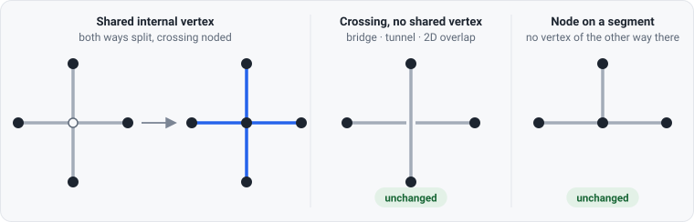
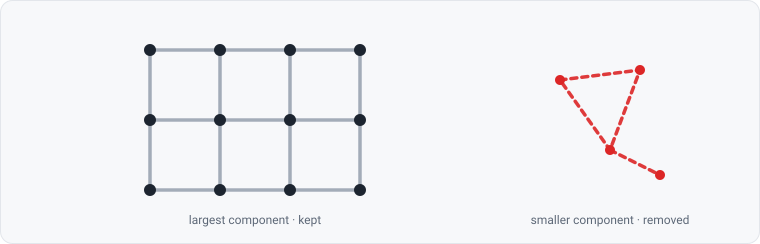
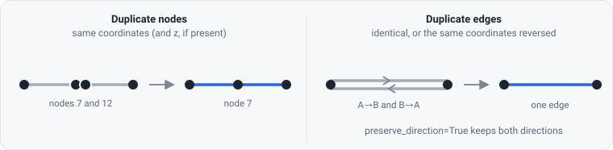
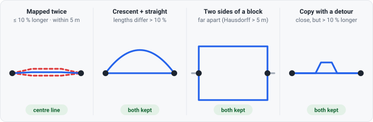
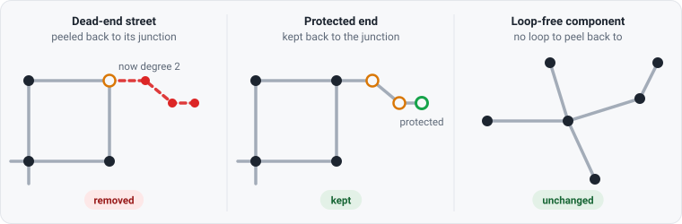

# Network topology and cleaning

*A visual guide to `cityImage.network_topology`: what `clean_network` does to a street network,
case by case, and how its steps depend on each other.*


**Contents** —
[Three rules](#three-rules) ·
[The pipeline](#the-pipeline) ·
[Before the loop](#before-the-loop) ·
[The cleaning loop](#the-cleaning-loop) ·
[How the steps depend on each other](#how-the-steps-depend-on-each-other) ·
[Consolidating junctions](#consolidating-junctions) ·
[Recipes](#recipes) ·
[Things to know](#things-to-know) ·
[Function reference](#function-reference)

---

## Three rules

Every step below follows three rules. When a result looks surprising, one of these is usually
the reason.

| | Rule | In practice |
| --- | --- | --- |
| **1** | **No node is ever added.** | A way is split only at a vertex it already has. No midpoint or other artificial node is created, not even to separate two parallel streets. |
| **2** | **Parallel streets stay parallel.** | Two different streets between the same two junctions (a crescent and a straight road, the two sides of a block) remain two edges with the same `u`–`v`. |
| **3** | **A street is only reduced when it is mapped more than once.** | Copies of one street collapse to their middle one: a real edge, or, with an even number of copies, the centre line of the two middle ones. Nothing else is averaged or redrawn. |

Nothing moves either: apart from snapping each edge's two end points onto its nodes and the centre
line of a street mapped an even number of times, coordinates stay exactly as they were in the
input.

---

## The pipeline

```python
nodes, edges = ci.clean_network(
    nodes, edges,
    dead_ends=False,               # peel dead-end streets
    remove_islands=True,           # keep the largest connected component
    same_vertexes_edges=True,      # collapse a street mapped twice
    self_loops=True,               # remove loop streets
    fix_topology=False,            # node ways crossing at a shared vertex
    preserve_direction=False,      # treat u→v and v→u as different edges
    nodes_to_keep_regardless=None, # nodeIDs never peeled or merged
    same_vertexes_tolerance=5.0,   # CRS units (metres in a projected CRS)
)
```


Dashed boxes are optional and run only when their flag is on.

| Option | Default | Steps | Effect |
| --- | --- | --- | --- |
| `fix_topology` | `False` | 3 | Splits ways that cross at a shared vertex without a node there. |
| `dead_ends` | `False` | 4, 6b, 6f | Removes dead-end streets back to the junction they hang from. |
| `remove_islands` | `True` | 5 | Keeps only the largest connected component. |
| `same_vertexes_edges` | `True` | 6d, loop exit | Reduces a street mapped more than once between the same nodes to one edge. |
| `same_vertexes_tolerance` | `5.0` | 6d | Largest Hausdorff distance between two copies of one street. |
| `self_loops` | `True` | 6b, 6c, 6f | **`True` removes** self-loops (loop streets); `False` keeps them. |
| `preserve_direction` | `False` | 6c, 6d, 6e | Treats `u→v` and `v→u` as different edges, never duplicates of each other, and keeps a pseudo-node where a one-way street's direction would be lost. |
| `nodes_to_keep_regardless` | `[]` | 4, 6b, 6e, 6f | Nodes that are never peeled as dead ends or merged as pseudo-nodes. |

> **Watch the flag names.** `self_loops=True` and `dead_ends=True` mean *remove* them. The
> flags name the operation, not what is kept.

**Input.** A nodes frame with `nodeID` and Point geometry, and an edges frame with `edgeID`, `u`,
`v` and LineString geometry, both in a **projected CRS**, because every tolerance is in CRS units.
`network_from_lines`, `network_from_file` and `network_from_osm` produce this schema.
**Output.** The same schema, indexed by `nodeID` / `edgeID` (`drop=False`), with `length`
recomputed. IDs are not made contiguous; `reset_index_graph_gdfs` does that.

---

## Before the loop

### Pass-through vertices: `fix_fake_self_loops` (always runs)


An edge with an **internal** vertex on an existing node is split at that node. This typically
happens when a way runs through a junction it was never split at: the node exists because other
streets end there, but this way does not know it. It also covers a way that loops back through
its own first or last node. Despite the function's name, the case is not limited to self-loops.

- Coordinates are compared to 10 decimal places; there is no distance tolerance.
- **IDs and columns are kept.** The first piece of a split edge keeps its `edgeID` and all its
  columns; the other pieces are copies of it with new `edgeID`s after the largest one. Nodes are
  left as they are.
- **Pieces follow the geometry.** A node is found by its point or by the end of any edge labelled
  with it, and each piece's `u`/`v` follow the direction the line is drawn in, so an edge stored
  against its labels is still split correctly.

### Shared vertices: `fix_network_topology` (`fix_topology=True`)



| Case | Shares a vertex? | Result |
| --- | --- | --- |
| Two ways cross mid-way at a vertex both of them carry | yes | **Both split**, a junction is formed |
| A bridge over a road, a tunnel, a 2D-only overlap | no | Unchanged: grade-separated crossings must not be noded |
| A way's end point lies on another way's segment, with no vertex there | no | Unchanged: adding one would break rule 1 |

The case where one way's **end point** sits on another way's internal vertex is already handled
by step 2. What `fix_topology` adds is the crossing where *neither* way ends. The new junction
gets the next `nodeID` after the largest and is shared by every way split there. Its `z` is
interpolated along the way between its end nodes; its other columns are left empty (integer and
boolean columns become nullable to hold that). Split edges keep their IDs as in step 2.

> **Why topology comes first.** Two ways that cross at a shared vertex are not connected until
> the crossing is noded. Before that, a dead-end or island test sees one of them as cut off and
> deletes it. `clean_network` therefore fixes topology *before* removing dead ends and islands.

### Dead ends and islands (`dead_ends`, `remove_islands`)

`fix_dead_ends` runs once here, then again inside the loop. It is covered
[with the loop](#the-cleaning-loop), under *Dead ends*.



`remove_disconnected_islands` keeps the **largest connected component**, measured by number of
nodes, and drops everything else. It runs **once**, before the loop. That is enough, because
nothing in the loop can split a component: merging, de-duplicating and peeling leaves never
disconnect what remains.

---

## The cleaning loop

The loop runs **at least once**, recomputing `length` at the start of each pass, and repeats
while either of these holds:

- some node has degree 2, other than a protected node or a node whose only edge is a self-loop;
- `same_vertexes_edges` is on and some pair of nodes still has a street mapped twice.

### Duplicate nodes and edges (steps 6a, 6c)



- **`clean_duplicate_nodes`**: nodes with identical geometry (and identical `z`, if there is a
  `z` column) become one, and edges are re-pointed to it. Nodes that are merely *close* are left
  alone; that is what [`consolidate_nodes`](#consolidating-junctions) is for.
- **`clean_duplicate_edges`**: drops edges with identical geometry and, unless
  `preserve_direction=True`, edges with the same coordinates in reverse order. The first row is
  kept. Nodes no edge references are dropped.
- Called **on its own**, `clean_duplicate_edges` keeps self-loops (`self_loops=False` by
  default). Inside `clean_network` it follows `clean_network`'s `self_loops`.

### A street mapped twice: `clean_same_vertexes_edges` (step 6d)



Edges that join the **same pair of nodes** are compared two at a time. Two edges count as **the
same street** only when both tests pass:

| Test | Threshold | Keeps apart |
| --- | --- | --- |
| Length | the longer is at most **10 %** longer than the shorter | a crescent and the straight road it bows away from |
| Distance | Hausdorff distance ≤ **`same_vertexes_tolerance`** (5 m) | two sides of a block, which have the same length but lie far apart |

- **Matches chain.** If A matches B and B matches C, all three are one street, even when A and C
  do not match directly. The result does not depend on row order.
- **The middle copy is kept.** Copies are ranked by their total Hausdorff distance to the others
  (ties to the shorter edge, then to the lower `edgeID`). With an odd number (3, 5, …) the most
  central copy is kept as mapped. With an even number (2, 4, …) there is no middle copy: the
  edge becomes the **centre line of the two most central** (`center_line`, averaged at the same
  fractions of their length, 3D when both are), in the direction and with the row, `edgeID` and
  attributes of the first of them. Its ends are the same two nodes, so no node is added.
- **Self-loops are skipped.** Whether they stay is up to `self_loops`.
- **Only edges with the same `u`–`v` are compared.** Two copies of a street that are split at
  different points are not compared until pseudo-node merging gives them the same end nodes. This
  is one reason the loop repeats.

> Converting to a graph: `graph_fromGDF` builds an `nx.Graph`, which holds one edge per node
> pair, so it keeps the **shortest** of parallel edges (the one a shortest path would use). A
> two-way street mapped as two opposing one-ways between the same nodes then keeps only one
> direction: for one-way routing, use `multiGraph_fromGDF`. Both graphs keep each edge's `u`, `v`
> and `oneway` as attributes.
> `multiGraph_fromGDF` keeps them all. For edge measures such as betweenness, weighted by
> `length`, the two give the same values: `append_edges_metrics` gives the parallel streets a
> `Graph` leaves out 0, and networkx gives them 0 on a `MultiGraph` too, since no shortest path
> takes them. Unweighted, a `MultiGraph` splits a value evenly between parallel streets.

### Pseudo-nodes: `simplify_graph` (step 6e)


A **pseudo-node** has degree 2: it joins exactly two segments and is not a real junction. It is
removed and its two segments are merged into one edge.

- **Degree counts end points.** A node's degree is how often it appears as `u` or `v`, so a
  self-loop counts twice.
- **Attributes of a merged edge.** For each column, the edge takes the non-null value that covers
  the **most length** among the pieces merged into it (`High St` in the figure: 85 of 100 m).
  A missing value never wins over a real one, ties go to the first piece, and column dtypes are
  kept. The merged edge keeps the `edgeID` of its first piece.
- **Protected nodes** (`nodes_to_keep_regardless`) are never merged. Use them for stations,
  entrances and other points that must stay nodes.
- **Crescents become parallel edges.** When the merged edge joins two nodes that are already
  joined, both edges stay (rule 2). No midpoint is added to tell them apart (rule 1).
- **One-way streets, with `preserve_direction=True`.** A one-way edge runs `u → v` (`oneway`
  True, 1 or `"yes"`). A pseudo-node is kept where merging would lose that: one segment is
  one-way and the other is not, or both are one-way but both start, or both end, at the node.
  One-way segments that run on from one into the other are merged in their direction. Without
  `preserve_direction` the network is undirected and a merged edge takes the `oneway` covering
  most of its length.

### Loop streets: `self_loops` (steps 6b, 6c, 6f)


A **loop street** leaves a junction and returns to it. However it is mapped, it ends up in the
same place:

| Mapped as | What the loop does |
| --- | --- |
| one closed edge (`u = v`) | already a self-loop |
| two edges through one node (two different streets between A and B, where B joins nothing else) | B has degree 2 and is merged, which closes the loop at A |
| edges through several nodes | each pseudo-node is merged in turn; the last merge closes the loop |

- **`self_loops=False`.** The loop stays as **one self-loop edge**. Its junction keeps
  a degree of at least 3, so it is not a pseudo-node.
- **`self_loops=True` (default).** The loop is dropped. Its junction may drop to degree 2 and be merged
  (as in the figure) or to degree 1 and become a dead end.

### Dead ends: `fix_dead_ends` (steps 4, 6b, 6f)



- **Peeled back to the junction.** A degree-1 node and its segment are removed, repeatedly, until
  the street is gone back to the junction where it meets the rest of the network.
- **Protected nodes stop the peel.** A dead-end street ending at a protected node is kept, all the
  way back to the junction.
- **Loop-free components are left as they are.** A tree has no junction to peel back to, and
  peeling would erase it, so it is kept whole.
- **Loops count.** A self-loop adds 2 to its node's degree. While loops are kept, a street that
  ends in a loop street is not a dead end.

---

## How the steps depend on each other


No single step can finish on its own, because each one can create work for another:

| When… | …it can leave | …for |
| --- | --- | --- |
| a duplicate node is merged | two identical edges | `clean_duplicate_edges` |
| a duplicate or a copy of a street is dropped | a degree-2 node | `simplify_graph` |
| a dead end is peeled | a degree-2 junction | `simplify_graph` |
| two segments are merged | a second edge between an already-joined pair | `clean_same_vertexes_edges` |
| the last pseudo-node of a loop street is merged | a self-loop | `self_loops` |
| a self-loop is removed | a degree-2 junction, or a degree-1 one | `simplify_graph` / `fix_dead_ends` |

That is why the steps run in a loop until neither exit condition holds.

> **For contributors.** Each exit test uses the same rule as the step it checks.
> `_are_nodes_simplified` and `simplify_graph` agree on which degree-2 nodes cannot be merged (a
> node whose only edge is a self-loop, and protected nodes). `_are_edges_simplified` and
> `clean_same_vertexes_edges` share `_same_streets`. If you change one side without the other,
> the loop never ends.

---

## Consolidating junctions

`consolidate_nodes` is **not** part of `clean_network`. Use it when one junction is mapped as
several nodes, such as a crossing of dual carriageways or a large roundabout.

```python
nodes, edges = ci.consolidate_nodes(nodes, edges, consolidate_edges_too=True, tolerance=20)
nodes, edges = ci.clean_network(nodes, edges)   # tidy what consolidation leaves behind
```


1. **Clusters.** Nodes with the most neighbours within `tolerance` seed first. A node joins a
   cluster only if it lies within `tolerance` of **every** member already admitted, so
   `tolerance` is the largest distance between any two merged nodes and clusters never chain
   along a street. The result does not depend on row order.
2. **Connectivity.** Inside a cluster, nodes that are not linked by edges within the cluster are
   split back into separate nodes, so two close but unconnected streets are not fused.
3. **Placement.** Each consolidated node sits at the **mean** of its members; `z` is averaged
   when present. `old_nodeID` lists the merged IDs, and `nodeID` is the new cluster ID.
4. **Edges** (`consolidate_edges_too=True`, or `consolidate_edges`): `u`/`v` are re-pointed,
   end points are snapped to the new nodes (keeping each edge's 2D/3D dimensionality), and edges
   that now start and end at the same node are dropped. That removes the short links inside the
   junction, and also any loop street whose ends fall in one cluster.

Consolidation can leave pseudo-nodes, parallel edges and duplicates, so run `clean_network`
afterwards.

---

## Recipes

**Structure: centrality, districts, Image of the City**

```python
nodes, edges = ci.clean_network(nodes, edges, fix_topology=True, dead_ends=True)
```

**Walking and routing**: keep dead ends and loop streets, since they are real destinations.

```python
nodes, edges = ci.clean_network(nodes, edges, fix_topology=True, dead_ends=False)
```

**Protected nodes (stations, entrances)**: pass their `nodeID`s. Splitting never renumbers
existing nodes, so the IDs stay valid through the whole pipeline.

```python
nodes, edges = ci.clean_network(nodes, edges, fix_topology=True, dead_ends=True,
                                nodes_to_keep_regardless=station_ids)
```

**Collapsing a busy junction**: consolidate, then clean (see [Consolidating junctions](#consolidating-junctions)).

---

## Things to know

- **IDs survive, but not all of them.** Existing IDs are never renumbered. Nodes and edges that are
  merged or removed take their IDs with them, a split adds new ones after the largest, and IDs
  are not made contiguous.
- **Protection does not stop island removal.** `nodes_to_keep_regardless` shields a node from
  dead-end peeling and pseudo-node merging, but a protected node on a component other than the
  largest is removed with it. Pass `remove_islands=False` to keep it.
- **Dual carriageways between the same two junctions** are two streets at the default
  `same_vertexes_tolerance=5`; raise it (e.g. to 10) to collapse them into one edge.
- **Tolerances are in CRS units.** `same_vertexes_tolerance=5` means 5 metres only in a metric
  projected CRS. In EPSG:4326 it means 5 degrees.
- **Coordinates are matched, not measured.** Splitting compares coordinates to 10 decimal places
  and duplicate nodes need identical geometry. Nodes that are close but not
  identical are left to `consolidate_nodes`.
- **`highway=elevator` edges are dropped** when there is a `highway` column.
- **End points are snapped at the end.** `correct_edge_geometries` sets each edge's first and last
  coordinate to its `u` and `v` node; internal vertices are not touched.
- **Parallel edges and graphs.** `graph_fromGDF` keeps the shortest of parallel edges;
  `multiGraph_fromGDF` keeps all of them. `append_edges_metrics` on a `Graph` gives the parallel
  streets it leaves out 0, the exact value for shortest-path measures and the value a weighted
  `MultiGraph` gives them.
- **Row lookups need the ID index.** Standalone helpers look rows up with `.loc[ID]`. Keep frames
  indexed by `nodeID` / `edgeID` (`set_index("nodeID", drop=False)`), especially after reloading
  from GeoPackage.

---

## Function reference

All of these are public (`ci.<name>`). Pass copies if you need the originals afterwards:
`clean_duplicate_nodes` re-points `u`/`v` and `correct_edge_geometries` rewrites geometry on the
edges frame it is given.

| Function | Returns | Standalone notes |
| --- | --- | --- |
| `clean_network` | `nodes, edges` | The whole pipeline above. |
| `fix_fake_self_loops` | `nodes, edges` | Keeps IDs and columns; split pieces get new edgeIDs. |
| `fix_network_topology` | `nodes, edges` | Keeps IDs and columns; adds a node at each new junction. |
| `remove_disconnected_islands` | `nodes, edges` | Largest component by node count. |
| `fix_dead_ends` | `nodes, edges` | Takes `nodes_to_keep_regardless`. |
| `clean_duplicate_nodes` | `nodes, edges` | Exact geometry (and `z`). |
| `clean_duplicate_edges` | `nodes, edges` | Keeps self-loops unless `self_loops=True`. |
| `clean_same_vertexes_edges` | `nodes, edges` | Takes `preserve_direction`, `same_vertexes_tolerance`. |
| `simplify_graph` | `nodes, edges` | Takes `nodes_to_keep_regardless`; keeps self-loops. |
| `correct_edge_geometries` | `edges` | Snaps end points to nodes. |
| `consolidate_nodes` | `nodes` or `nodes, edges` | `consolidate_edges_too=True` returns edges too. |
| `consolidate_edges` | `edges` | Takes the edges and the output of `consolidate_nodes`. |

Full signatures are in the [API reference](https://cityimage.readthedocs.io/en/latest/api.html).
